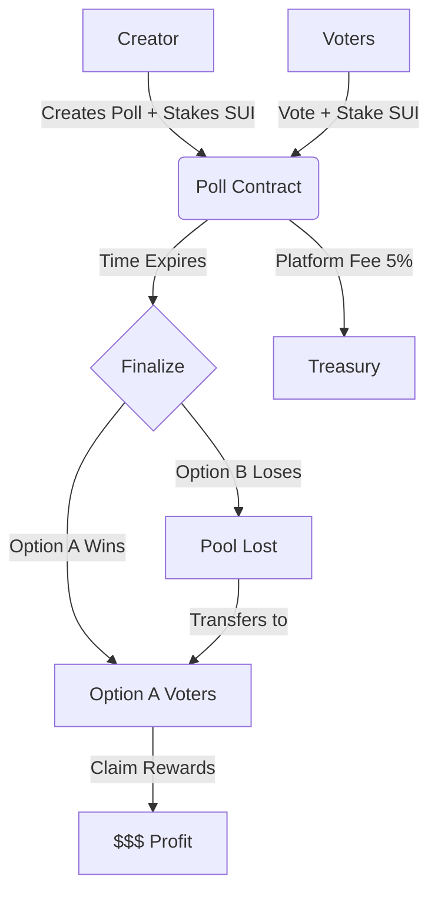

# PollDrop

A decentralized polling platform on Sui blockchain where users stake SUI tokens to vote, and winners share the reward pool.

## Overview

PollDrop enables anyone to create prediction markets and community polls with real economic incentives. Voters stake SUI tokens on their choice, and those who voted for the winning option split the pool (minus a 5% platform fee).



```ascii
+---------+       +-----------+       +-----------+
| Creator | ----> |   Poll    | <---- |  Voters   |
+---------+       | Contract  |       +-----------+
     |            +-----------+             |
  Stakes SUI            |               Stake SUI
                        v
                 +-------------+
                 |  Total Pool |
                 +-------------+
                        |
                  Time Expires
                        |
             +----------+----------+
             |                     |
     [Winning Option]       [Losing Option]
             |                     |
      Claim Rewards            Pool Lost
             |                     |
    +--------v--------+   +--------v--------+
    | Winners Share   |   |   (Redistributed|
    | Pool - 5% Fee   |   |    to Winners)  |
    +-----------------+   +-----------------+
```

## Smart Contract Architecture

### Core Functions

- **`create_poll`**: Initialize a new poll with options, expiry, and creator deposit
- **`vote`**: Cast a vote by depositing the required amount
- **`finalize`**: Determine the winning option after expiration
- **`claim_reward`**: Distribute rewards to winning voters

### Events

- **`PollEvent`**: Emitted when a poll is created
- **`VoteEvent`**: Emitted when a vote is cast
- **`FinalizeEvent`**: Emitted when a poll is finalized
- **`ClaimEvent`**: Emitted when rewards are claimed

### Economic Model

1. **Creator Deposit**: Poll creator stakes the initial pool amount
2. **Voter Deposits**: Each voter stakes the same amount as the creator
3. **Platform Fee**: 5% deducted from total pool on first claim
4. **Winner Distribution**: Remaining pool split equally among winners
5. **Proportional Claiming**: Each winner claims their share independently

## Security Considerations

- **No Partial Withdrawals**: Winners must claim their full share
- **Idempotent Claims**: Each address can only claim once
- **Expiry Enforcement**: Votes rejected after expiration
- **Creator Exclusion**: Poll creator cannot vote
- **Duplicate Vote Prevention**: Each address can vote only once
